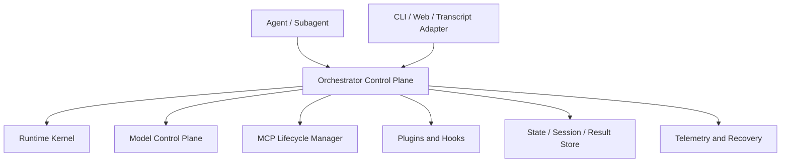
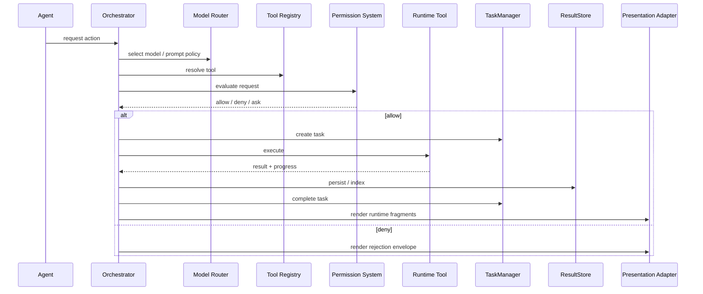

# Design Document: Supercode Agent Orchestration Kernel

## D1. Overview

Supercode is a TypeScript orchestration kernel for tool-using AI agents. It is designed as a control plane, not as a UI application. Interactive frontends are adapters layered on top of a headless runtime. Curated skills and rules are layered on top of the kernel as installable workflow packs rather than being embedded into core runtime behavior.

This revision makes four architectural changes explicit:

1. Runtime contracts are separated from presentation contracts.
2. Model invocation is governed by a first-class model control plane.
3. MCP is treated as a lifecycle-managed, health-monitored, trust-scoped subsystem.
4. The package is traceable: requirements map to contracts, owners, and verification.

## Document Control

- Architecture Package Version: `1.0.0-draft`
- Last Updated: `2026-04-01`

### Change History

| Version | Date | Summary |
| --- | --- | --- |
| `1.0.0-draft` | `2026-04-01` | Replaced the monolithic design with layered runtime, presentation, model-control, MCP, and governance contracts. |

### D1.1 Design Goals

- Keep the execution kernel reusable in CLI, web, worker, and service environments.
- Preserve strong contracts around tools, tasks, permissions, progress, and sessions.
- Make model selection, prompting, budget, memory, and fallback explicit.
- Prevent implicit trust expansion when integrating plugins or MCP servers.
- Make correctness properties testable before product code exists.

### D1.2 Non-Goals

- This document does not prescribe a single UI technology.
- This document does not lock the product to one model vendor.
- This document does not require all extensions to run in-process.

## D2. Layered Architecture

### D2.1 Layer Boundaries



The kernel is split into five layers:

- **Runtime kernel**: Tool execution, task lifecycle, permission checks, progress emission, and state mutation.
- **Presentation layer**: Rendering adapters that translate runtime events and result envelopes into CLI, web, or transcript output.
- **Model control plane**: Provider abstraction, model routing, prompt versioning, memory selection, and budget enforcement.
- **Integration plane**: MCP, plugins, hooks, workflow packs, and other externally sourced capabilities.
- **Persistence and audit plane**: Sessions, state, result persistence, telemetry, recovery, and traceability.

### D2.2 Architectural Rule

The runtime kernel MUST NOT depend on React, DOM APIs, terminal rendering primitives, or any other frontend-specific object model. Presentation adapters consume runtime-safe fragments and state snapshots.

### D2.3 Runtime Flow



### D2.4 Directory Structure

```text
Supercode/
|-- requirements.md
|-- design.md
|-- traceability-matrix.md
|-- mcp-lifecycle-security.md
|-- src/
|   |-- runtime/
|   |   |-- Orchestrator.ts
|   |   |-- tools/
|   |   |   |-- RuntimeTool.ts
|   |   |   |-- ToolRegistry.ts
|   |   |   `-- ToolResultStore.ts
|   |   |-- tasks/
|   |   |   |-- TaskManager.ts
|   |   |   `-- TaskStateMachine.ts
|   |   |-- permissions/
|   |   |   `-- PermissionSystem.ts
|   |   |-- progress/
|   |   |   `-- ProgressTracker.ts
|   |   `-- state/
|   |       |-- AppStateStore.ts
|   |       `-- UserModificationTracker.ts
|   |-- presentation/
|   |   |-- PresentationAdapter.ts
|   |   |-- ToolPresentation.ts
|   |   `-- TranscriptRenderer.ts
|   |-- models/
|   |   |-- ModelProvider.ts
|   |   |-- ModelRouter.ts
|   |   |-- PromptRegistry.ts
|   |   |-- BudgetPolicy.ts
|   |   `-- EvaluationHarness.ts
|   |-- mcp/
|   |   |-- MCPIntegration.ts
|   |   |-- MCPTransport.ts
|   |   |-- MCPHealthMonitor.ts
|   |   `-- MCPTrustPolicy.ts
|   |-- extensions/
|   |   |-- PluginLoader.ts
|   |   `-- HookSystem.ts
|   |-- workflows/
|   |   |-- WorkflowCatalog.ts
|   |   |-- WorkflowInstaller.ts
|   |   `-- PackValidator.ts
|   `-- services/
|       |-- ConfigManager.ts
|       |-- RecoveryManager.ts
|       `-- TelemetrySystem.ts
`-- tests/
    |-- contracts/
    |-- integration/
    `-- invariants/
```

## D3. Runtime Kernel Contracts

### D3.1 Runtime Tool Contract

```typescript
type ToolId = string;
type InterruptBehavior = "cancel" | "block";
type SideEffectLevel = "read_only" | "write_scoped" | "write_unscoped" | "destructive";
type ConcurrencyMode = "safe" | "serialize_by_key" | "exclusive";

interface RuntimeTool<Input = unknown, Output = unknown, Progress = RuntimeProgressData> {
  id: ToolId;
  aliases?: string[];
  searchHints?: string[];
  runtime: RuntimeToolContract<Input, Output, Progress>;
  presentation?: ToolPresentationContract<Input, Output, Progress>;
}

interface RuntimeToolContract<Input, Output, Progress> {
  schemas: ToolSchemaContract<Input, Output>;
  characteristics: ToolCharacteristics<Input>;
  permissions: ToolPermissionDescriptor<Input>;
  execute(
    input: Input,
    context: ToolExecutionContext,
    reporter?: ProgressReporter<Progress>,
  ): Promise<ToolExecutionResult<Output>>;
  validateInput?(input: Input, context: ToolExecutionContext): Promise<ValidationResult>;
}

interface ToolCharacteristics<Input> {
  maxResultSizeChars: number;
  alwaysLoad?: boolean;
  deferLoading?: boolean;
  interruptBehavior?(input: Input): InterruptBehavior;
  sideEffectLevel(input: Input): SideEffectLevel;
  concurrency(input: Input): ConcurrencyDescriptor;
  isEnabled(context: ToolExecutionContext): boolean;
}

interface ConcurrencyDescriptor {
  mode: ConcurrencyMode;
  scopeKey?: string;
}
```

The runtime contract is the minimum required for headless execution. A tool may omit `presentation` entirely and still be valid.

### D3.2 Tool Registry

```typescript
interface ToolRegistry {
  register(tool: RuntimeTool): void;
  registerBatch(tools: RuntimeTool[]): void;
  unregister(toolId: ToolId): void;

  get(toolIdOrAlias: string): RuntimeTool | undefined;
  list(): readonly RuntimeTool[];
  listEnabled(context: ToolExecutionContext): readonly RuntimeTool[];

  search(query: string): RuntimeTool[];
  listDeferred(): RuntimeTool[];
  listAlwaysLoaded(): RuntimeTool[];

  validate(tool: RuntimeTool): ValidationResult;
  refreshDynamicTools(source: DynamicToolSource): Promise<void>;
}

type DynamicToolSource = "mcp" | "plugin" | "policy";
```

### D3.3 Tool Schema Contract

```typescript
type SchemaLike<T> = z.ZodType<T> | JsonSchema;
type StrictnessMode = "strict" | "passthrough" | "legacy_compat";

interface ToolSchemaContract<Input, Output> {
  inputSchema: SchemaLike<Input>;
  outputSchema?: SchemaLike<Output>;
  strictness: StrictnessMode;
  partialInputSchema?: SchemaLike<Partial<Input>>;
  observableInputBackfill?: (input: Partial<Input>) => Input;
  equivalentInputs?(left: Input, right: Input): boolean;
  preparePermissionMatcher?(input: Input): PermissionMatchInput;
}

type JsonSchema = Record<string, unknown>;
type PermissionMatchInput = Record<string, string | number | boolean>;
```

Schema contracts address strictness, backfill, and equivalence explicitly. That closes the gap between "schema exists" and "schema evolves safely".

### D3.4 Tool Execution Context

```typescript
interface ToolExecutionContext {
  session: SessionHandle;
  state: RuntimeStateAccess;
  permissions: PermissionSystem;
  tasks: TaskManager;
  progress: ProgressTracker;
  results: ToolResultStore;
  fileCache: FileStateCache;
  userModifications: UserModificationTracker;
  messages: readonly Message[];
  tools: ToolRegistry;
  commands: readonly Command[];
  mcp: MCPServiceHandle;
  budget: BudgetSnapshot;
  limits: RuntimeLimits;
  abortController: AbortController;
  nestedMemoryTriggers?: Set<string>;
  dynamicSkillTriggers?: Set<string>;
}

interface RuntimeLimits {
  fileReading?: { maxTokens?: number; maxSizeBytes?: number };
  globbing?: { maxResults?: number };
  resultPersistence?: { maxInlineChars: number };
}
```

This context is runtime-only. UI callbacks, JSX setters, and theme state do not belong here.

### D3.5 Tool Result Store

```typescript
interface ToolExecutionResult<T> {
  data: T;
  metadata?: Record<string, unknown>;
  searchableText?: string;
  queuedMessage?: RuntimeEnvelope;
  rejectionMessage?: RuntimeEnvelope;
  errorMessage?: RuntimeEnvelope;
  contextPatch?: RuntimeContextPatch;
}

interface ToolResultStore {
  persist(record: ToolResultRecord): Promise<PersistedResultRef>;
  get(ref: PersistedResultRef): Promise<ToolResultRecord>;
  search(query: ResultQuery): Promise<ToolResultRecord[]>;
  truncateForInline(record: ToolResultRecord, maxChars: number): InlineResultPreview;
  applyRetention(policy: ResultRetentionPolicy): Promise<void>;
}

interface ToolResultRecord {
  resultId: string;
  toolUseId: string;
  toolId: ToolId;
  createdAt: number;
  truncated: boolean;
  inlinePreview: string;
  searchableText: string;
  payload: unknown;
  metadata: Record<string, unknown>;
  persistedPath?: string;
}
```

## D4. Presentation Contracts

### D4.1 Presentation Fragment Model

Presentation is adapter-driven. The runtime emits envelopes and fragments; the frontend decides how to render them.

```typescript
type RenderMode = "compact" | "verbose" | "transcript" | "json";

interface PresentationFragment {
  kind: "text" | "status" | "table" | "code" | "kv" | "group";
  text?: string;
  status?: "info" | "success" | "warning" | "error";
  children?: PresentationFragment[];
  metadata?: Record<string, unknown>;
}

interface RuntimeEnvelope {
  title: string;
  fragments: PresentationFragment[];
  metadata?: Record<string, unknown>;
}

interface PresentationContext {
  mode: RenderMode;
  theme?: string;
  locale?: string;
  relativeTimeFormatter?: (timestamp: number) => string;
}
```

### D4.2 Tool Presentation Contract

```typescript
interface ToolPresentationContract<Input, Output, Progress> {
  describe(input: Partial<Input>): string;
  renderUse(input: Partial<Input>, context: PresentationContext): RuntimeEnvelope;
  renderResult(result: Output, progress: ProgressMessage<Progress>[], context: PresentationContext): RuntimeEnvelope;
  renderProgress?(progress: ProgressMessage<Progress>[], context: PresentationContext): RuntimeEnvelope;
  renderQueued?(envelope: RuntimeEnvelope, context: PresentationContext): RuntimeEnvelope;
  renderRejected?(envelope: RuntimeEnvelope, context: PresentationContext): RuntimeEnvelope;
  renderError?(envelope: RuntimeEnvelope, context: PresentationContext): RuntimeEnvelope;
}

interface PresentationAdapter<Node = unknown> {
  id: "cli" | "react" | "transcript" | "json" | string;
  render(envelope: RuntimeEnvelope, context: PresentationContext): Node;
}
```

This split makes alternate frontends and headless transcript export straightforward.

## D5. Task Management and Concurrency Safety

### D5.1 Task Contracts

```typescript
type TaskType =
  | "local_bash"
  | "local_agent"
  | "remote_agent"
  | "in_process_teammate"
  | "local_workflow"
  | "monitor_mcp"
  | "dream";

type TaskStatus = "pending" | "running" | "completed" | "failed" | "killed";

interface TaskState {
  id: string;
  type: TaskType;
  status: TaskStatus;
  description: string;
  owner: string;
  toolUseId?: string;
  createdAt: number;
  startedAt?: number;
  endedAt?: number;
  totalPausedMs: number;
  outputRef?: PersistedResultRef;
  outputOffset: number;
  transitional: boolean;
  lastTransitionReason?: string;
}

interface TaskManager {
  createTask(type: TaskType, description: string, owner: string, toolUseId?: string): TaskState;
  transition(taskId: string, expected: TaskStatus[], next: TaskStatus, reason?: string): TaskState;
  appendOutput(taskId: string, chunk: string): Promise<void>;
  get(taskId: string): TaskState | undefined;
  list(filter?: { type?: TaskType; status?: TaskStatus }): TaskState[];
  getAbortController(taskId: string): AbortController | undefined;
  abort(taskId: string): Promise<void>;
  cleanup(taskId: string): Promise<void>;
}
```

Atomic `transition` is the central invariant boundary. There is no direct mutation path that bypasses expected-state checks.

### D5.2 Concurrency Coordination

```typescript
interface ConcurrencyCoordinator {
  acquire(toolId: ToolId, descriptor: ConcurrencyDescriptor): Promise<ReleaseHandle>;
  isInProgress(toolUseId: string): boolean;
  listInProgress(): readonly string[];
}

interface ReleaseHandle {
  release(): void;
}
```

## D6. Permission and Policy System

### D6.1 Permission Contracts

```typescript
type PermissionMode = "default" | "auto" | "bypass";
type PermissionBehavior = "allow" | "deny" | "ask";

interface PermissionRule {
  pattern: string;
  effect: PermissionBehavior;
  source: "user" | "policy" | "system";
  createdAt: number;
}

interface PermissionRequest {
  toolId: ToolId;
  input: unknown;
  sideEffectLevel: SideEffectLevel;
  actor: { agentId?: string; sessionId: string; interactive: boolean };
  workingDirectory?: string;
}

interface PermissionDecision {
  behavior: PermissionBehavior;
  reasonCode: string;
  source: "user" | "policy" | "system" | "derived";
  decidedAt: number;
  sanitizedInput?: unknown;
}

interface PermissionSystem {
  getMode(): PermissionMode;
  setMode(mode: PermissionMode): void;
  evaluate(request: PermissionRequest): Promise<PermissionDecision>;
  addRule(rule: PermissionRule): void;
  removeRule(pattern: string): void;
  enterTemporaryMode(mode: PermissionMode): void;
  exitTemporaryMode(): void;
  getAuditLog(): readonly PermissionAuditEntry[];
}

interface PermissionAuditEntry {
  request: PermissionRequest;
  decision: PermissionDecision;
}
```

Permissions are modeled as auditable decisions, not booleans.

## D7. Progress, Output, and Search

### D7.1 Progress Contracts

```typescript
type ProgressType =
  | "tool_progress"
  | "hook_progress"
  | "bash_progress"
  | "agent_progress"
  | "mcp_progress"
  | "repl_progress"
  | "skill_progress"
  | "task_output_progress"
  | "web_search_progress";

interface RuntimeProgressData {
  type: ProgressType;
  message: string;
  metadata?: Record<string, unknown>;
}

interface ProgressMessage<T = RuntimeProgressData> {
  toolUseId: string;
  timestamp: number;
  data: T;
}

interface ProgressTracker {
  report<T extends RuntimeProgressData>(toolUseId: string, data: T): void;
  list(toolUseId: string): readonly ProgressMessage[];
  latest(toolUseId: string): ProgressMessage | undefined;
  filter(toolUseId: string, type: ProgressType): readonly ProgressMessage[];
  subscribe<T extends RuntimeProgressData>(
    toolUseId: string,
    listener: (message: ProgressMessage<T>) => void,
  ): () => void;
}

type ProgressReporter<T> = (data: T) => void;
```

### D7.2 Result Search

```typescript
interface ResultQuery {
  text?: string;
  toolId?: ToolId;
  sessionId?: string;
  createdAfter?: number;
}

interface InlineResultPreview {
  preview: string;
  truncated: boolean;
  persistedPath?: string;
}
```

## D8. Agent and Model Control Plane

### D8.1 Agent Coordination

```typescript
interface AgentCoordinator {
  createRootAgent(input: RootAgentRequest): Promise<AgentContext>;
  spawnSubagent(parent: AgentContext, request: SubagentRequest): Promise<AgentContext>;
  completeAgent(agentId: string, outcome: AgentOutcome): Promise<void>;
  getAgent(agentId: string): AgentContext | undefined;
}

interface AgentContext {
  agentId: string;
  agentType: string;
  sessionId: string;
  parentAgentId?: string;
  depth: number;
  colorToken?: string;
  permissionCeiling: PermissionMode;
  preservedToolResults: boolean;
  promptContextRef?: string;
}
```

### D8.2 Model Provider Abstraction

```typescript
interface ModelProvider {
  providerId: string;
  listModels(): Promise<ModelDescriptor[]>;
  invoke(request: ModelInvocationRequest): Promise<ModelInvocationResult>;
  stream(request: ModelInvocationRequest): AsyncIterable<ModelDelta>;
  getHealth(): Promise<ProviderHealth>;
}

interface ModelDescriptor {
  modelId: string;
  providerId: string;
  family: string;
  contextWindow: number;
  supportsTools: boolean;
  supportsStreaming: boolean;
  trustTier: "first_party" | "approved_third_party" | "restricted";
  cost: { inputPer1k: number; outputPer1k: number };
  latencyTier: "fast" | "balanced" | "deep";
}
```

### D8.3 Model Routing and Fallback

```typescript
interface ModelRouter {
  select(request: ModelSelectionRequest): Promise<ModelSelectionDecision>;
  recordOutcome(outcome: ModelRouteOutcome): Promise<void>;
}

interface ModelSelectionRequest {
  taskType: TaskType | "conversation";
  requiresTools: boolean;
  requiresStreaming: boolean;
  trustTier: ModelDescriptor["trustTier"];
  budget: BudgetSnapshot;
  latencyTarget: "interactive" | "background";
}

interface ModelSelectionDecision {
  primary: ModelDescriptor;
  fallbacks: ModelDescriptor[];
  reason: string;
  budgetReservation: BudgetReservation;
}
```

### D8.4 Prompt Registry, Budget Policy, and Memory

```typescript
interface PromptRegistry {
  register(template: PromptTemplate): void;
  resolve(promptId: string, version?: string): PromptTemplate;
  render(request: PromptRenderRequest): RenderedPrompt;
}

interface PromptTemplate {
  promptId: string;
  version: string;
  description: string;
  body: string;
  variables: string[];
}

interface BudgetPolicy {
  reserve(request: BudgetReservationRequest): Promise<BudgetReservation>;
  finalize(reservationId: string, usage: UsageRecord): Promise<void>;
  snapshot(sessionId: string): Promise<BudgetSnapshot>;
}

interface MemoryPolicy {
  selectContext(request: MemorySelectionRequest): Promise<MemorySelection>;
  recordAttachment(result: MemoryAttachmentResult): Promise<void>;
}

interface EvaluationHarness {
  registerSuite(suite: EvaluationSuite): Promise<void>;
  run(request: EvaluationRunRequest): Promise<EvaluationReport>;
}
```

The model layer is part of the runtime control plane, not an implementation detail hidden inside the main loop.

## D9. Session, State, and User Modification Tracking

### D9.1 Session Management

```typescript
interface SessionManager {
  create(options: SessionOptions): Promise<Session>;
  get(sessionId: string): Promise<Session | undefined>;
  save(sessionId: string): Promise<void>;
  load(sessionId: string): Promise<Session>;
  background(sessionId: string): Promise<void>;
  resume(sessionId: string): Promise<void>;
  search(query: SessionQuery): Promise<Session[]>;
}

interface Session {
  sessionId: string;
  title?: string;
  createdAt: number;
  updatedAt: number;
  environment: Record<string, string>;
  messages: Message[];
  fileHistory: FileHistoryState;
  attribution: AttributionState;
  metadata: Record<string, unknown>;
}
```

### D9.2 Application State

```typescript
interface AppState {
  messages: Message[];
  tasks: Map<string, TaskState>;
  permissionMode: PermissionMode;
  permissionAudit: PermissionAuditEntry[];
  settings: Settings;
  sessionId: string;
  sessionTitle?: string;
  toolResults: Map<string, PersistedResultRef>;
  inProgressToolUseIds: Set<string>;
  toolDecisions: Map<string, PermissionDecision>;
  mcpSessions: Map<string, MCPServerSession>;
  agentContexts: Map<string, AgentContext>;
  userModifications: Map<string, UserModificationRecord>;
}

interface StateStore {
  getState(): AppState;
  transaction<T>(label: string, fn: (draft: AppState) => T): T;
  subscribe(listener: (state: AppState) => void): () => void;
  select<T>(selector: (state: AppState) => T): T;
  persist(): Promise<void>;
  restore(): Promise<void>;
  history(): readonly AppState[];
}
```

### D9.3 User Modification Tracking

```typescript
interface UserModificationTracker {
  record(change: UserModificationRecord): Promise<void>;
  get(path: string): Promise<UserModificationRecord | undefined>;
  listDirty(): Promise<UserModificationRecord[]>;
  acknowledge(path: string): Promise<void>;
}

interface UserModificationRecord {
  path: string;
  detectedAt: number;
  detectedBy: "user" | "tool" | "external_watcher";
  status: "dirty" | "conflict" | "acknowledged";
  baseHash?: string;
  currentHash?: string;
}
```

## D10. MCP Lifecycle and Security

The detailed operational spec lives in [mcp-lifecycle-security.md](/D:/SuperCode/Supercode/mcp-lifecycle-security.md). This section defines the contracts owned by the kernel.

### D10.1 MCP Session Contracts

```typescript
type MCPConnectionState =
  | "configured"
  | "connecting"
  | "authenticating"
  | "negotiating"
  | "ready"
  | "degraded"
  | "backoff"
  | "disconnected"
  | "quarantined";

interface MCPServerSession {
  serverId: string;
  displayName: string;
  state: MCPConnectionState;
  trustClass: "trusted" | "restricted" | "untrusted";
  isolation: MCPIsolationPolicy;
  capabilities?: MCPCapabilityProfile;
  health: MCPHealthStatus;
  lastError?: string;
}

interface MCPCapabilityProfile {
  protocolVersion: string;
  tools: readonly MCPToolDescriptor[];
  resources: readonly MCPResourceDescriptor[];
  supportsStreaming: boolean;
  maxConcurrentRequests?: number;
  authModes: readonly string[];
}
```

### D10.2 MCP Integration Interface

```typescript
interface MCPIntegration {
  registerServer(config: McpServerConfig): Promise<void>;
  connect(serverId: string): Promise<MCPServerSession>;
  disconnect(serverId: string): Promise<void>;
  listSessions(): Promise<MCPServerSession[]>;

  negotiate(serverId: string): Promise<MCPCapabilityProfile>;
  loadTools(serverId: string): Promise<RuntimeTool[]>;
  loadResources(serverId: string): Promise<readonly MCPResourceDescriptor[]>;

  invoke(serverId: string, toolName: string, input: unknown): Promise<unknown>;
  streamInvoke(serverId: string, toolName: string, input: unknown): AsyncIterable<unknown>;

  handleAuth(serverId: string): Promise<void>;
  handleElicitation(serverId: string, request: ElicitRequest): Promise<ElicitResult>;
  quarantine(serverId: string, reason: string): Promise<void>;
}
```

### D10.3 Trust, Isolation, and Health

```typescript
interface MCPTrustPolicy {
  classify(config: McpServerConfig): Promise<"trusted" | "restricted" | "untrusted">;
  authorizeConnection(config: McpServerConfig): Promise<AuthorizationResult>;
  authorizeExposure(serverId: string, capability: MCPCapabilityProfile): Promise<AuthorizationResult>;
  authorizeInvocation(serverId: string, toolName: string, input: unknown): Promise<AuthorizationResult>;
}

interface MCPIsolationPolicy {
  executionBoundary: "in_process" | "worker" | "subprocess" | "remote";
  filesystemAccess: "none" | "scoped" | "brokered";
  networkEgress: "none" | "restricted" | "policy_controlled";
  credentialAccess: "none" | "brokered" | "delegated";
}

interface MCPHealthMonitor {
  recordSuccess(serverId: string): Promise<void>;
  recordFailure(serverId: string, error: Error): Promise<void>;
  heartbeat(serverId: string): Promise<MCPHealthStatus>;
  scheduleReconnect(serverId: string): Promise<void>;
}
```

## D11. Plugins and Hooks

### D11.1 Plugin Contracts

```typescript
interface Plugin {
  name: string;
  version: string;
  description: string;
  dependencies?: string[];
  tools?: RuntimeTool[];
  commands?: Command[];
  hooks?: Hook[];
  activate(context: PluginContext): Promise<void>;
  deactivate(): Promise<void>;
}

interface PluginLoader {
  load(path: string): Promise<Plugin>;
  unload(name: string): Promise<void>;
  enable(name: string): Promise<void>;
  disable(name: string): Promise<void>;
  list(): Promise<Plugin[]>;
}
```

Plugins are extension sources, not trust roots. Plugin-provided MCP configurations still pass through `MCPTrustPolicy`.

### D11.2 Hook Contracts

```typescript
type HookType = "pre_tool_use" | "post_tool_use" | "session_start" | "session_end";

interface Hook {
  name: string;
  type: HookType;
  priority?: number;
  timeoutMs?: number;
  execute(context: HookContext): Promise<HookResult>;
}

interface HookResult {
  action: "approve" | "reject" | "modify";
  modifiedInput?: unknown;
  reason?: string;
}

interface HookSystem {
  register(hook: Hook): void;
  unregister(name: string): void;
  execute(type: HookType, context: HookContext): Promise<HookResult[]>;
}
```

### D11.3 Skills and Rules Catalog

Skills and rules are not part of the runtime kernel itself. They are packaged workflow knowledge that the kernel can discover, validate, install, and adapt to different hosts.

```typescript
type WorkflowPackKind = "core" | "language" | "framework" | "experimental";
type WorkflowScope = "user" | "project" | "package";
type RuleSeverity = "info" | "warning" | "error" | "critical";

interface SkillDefinition {
  skillId: string;
  version: string;
  title: string;
  description: string;
  triggers: SkillTrigger[];
  dependencies?: string[];
  instructions: WorkflowInstructionBlock[];
  examples?: WorkflowExample[];
  hostAdapters?: HostAdapterDescriptor[];
  provenance?: WorkflowProvenance;
}

interface RuleDefinition {
  ruleId: string;
  version: string;
  title: string;
  description: string;
  scope: WorkflowScope;
  precedence: number;
  severity: RuleSeverity;
  appliesTo: RuleTargetSelector[];
  statements: WorkflowRuleStatement[];
  hostAdapters?: HostAdapterDescriptor[];
  provenance?: WorkflowProvenance;
}

interface WorkflowPack {
  packId: string;
  version: string;
  kind: WorkflowPackKind;
  description: string;
  skills: SkillDefinition[];
  rules: RuleDefinition[];
  metadata?: Record<string, unknown>;
}

interface WorkflowCatalog {
  registerPack(pack: WorkflowPack): Promise<void>;
  listPacks(): Promise<WorkflowPack[]>;
  searchSkills(query: string): Promise<SkillDefinition[]>;
  searchRules(query: string): Promise<RuleDefinition[]>;
  enablePack(packId: string, scope: WorkflowScope): Promise<void>;
  disablePack(packId: string, scope: WorkflowScope): Promise<void>;
}

interface WorkflowInstaller {
  install(packRef: WorkflowPackReference, scope: WorkflowScope): Promise<InstalledWorkflowPack>;
  uninstall(packId: string, scope: WorkflowScope): Promise<void>;
  validate(pack: WorkflowPack): Promise<ValidationResult>;
  lint(pack: WorkflowPack): Promise<WorkflowLintReport>;
}

interface SkillTrigger {
  kind: "command" | "intent" | "file_pattern" | "manual";
  pattern: string;
}

interface WorkflowInstructionBlock {
  title: string;
  body: string;
}

interface WorkflowExample {
  input: string;
  output: string;
}

interface RuleTargetSelector {
  targetType: "language" | "framework" | "runtime" | "host";
  value: string;
}

interface WorkflowRuleStatement {
  statementId: string;
  text: string;
}

interface WorkflowPackReference {
  packId: string;
  version?: string;
}

interface InstalledWorkflowPack {
  packId: string;
  version: string;
  scope: WorkflowScope;
  installedAt: number;
}

interface WorkflowLintReport {
  valid: boolean;
  issues: string[];
}

interface HostAdapterDescriptor {
  target: "supercode" | "claude" | "codex" | "cursor" | "generic";
  format: "markdown" | "json" | "toml" | "yaml";
  pathHint?: string;
}

interface WorkflowProvenance {
  sourceType: "curated" | "reference_derived" | "user_defined";
  sourceRef?: string;
  reviewedAt?: number;
}
```

Curated packs should be informed by prior reference implementations, especially workflow-rich reference material, but they must be normalized into Supercode-owned, versioned definitions rather than copied as opaque host-specific assets.

## D12. Telemetry, Recovery, Configuration, and Performance

### D12.1 Telemetry

```typescript
interface TelemetryEvent {
  eventType: string;
  timestamp: number;
  subjectId: string;
  attributes: Record<string, unknown>;
  piiClass: "none" | "sanitized" | "restricted";
}

interface TelemetrySystem {
  emit(event: TelemetryEvent): Promise<void>;
  setOptOut(disabled: boolean): void;
  flush(): Promise<void>;
}
```

### D12.2 Recovery and Retry

```typescript
interface RecoveryManager {
  classify(error: unknown): FailureClassification;
  withRetry<T>(policy: RetryPolicy, operation: () => Promise<T>): Promise<T>;
  fallback<T>(plan: FallbackPlan<T>): Promise<T>;
  handleCritical(error: unknown): Promise<void>;
}

interface RetryPolicy {
  maxAttempts: number;
  initialDelayMs: number;
  maxDelayMs: number;
  jitter: boolean;
}
```

### D12.3 Configuration

```typescript
interface ConfigManager {
  load(): Promise<ResolvedConfig>;
  watch(onChange: (config: ResolvedConfig) => void): Promise<() => void>;
  migrate(input: unknown): Promise<ResolvedConfig>;
  explain(path: string): ConfigValueSource;
}

type ConfigValueSource = "cli" | "env" | "file" | "policy" | "default";
```

### D12.4 Performance

```typescript
interface PerformanceManager {
  profile(name: string, fn: () => Promise<unknown>): Promise<unknown>;
  getHotPathSummary(): Promise<HotPathSummary[]>;
  clearCaches(): Promise<void>;
}
```

## D13. Data Models

### D13.1 Task State Machine

```text
pending -> running -> completed
                 -> failed
                 -> killed
```

### D13.2 Session Handle

```typescript
interface SessionHandle {
  sessionId: string;
  title?: string;
}
```

### D13.3 Budget and Provider Records

```typescript
interface BudgetSnapshot {
  sessionId: string;
  maxUsd?: number;
  reservedUsd: number;
  spentUsd: number;
  estimatedTokensIn: number;
  estimatedTokensOut: number;
}

interface BudgetReservation {
  reservationId: string;
  amountUsd: number;
}

interface UsageRecord {
  promptTokens: number;
  completionTokens: number;
  costUsd: number;
}

interface ProviderHealth {
  providerId: string;
  status: "healthy" | "degraded" | "unavailable";
  checkedAt: number;
}
```

## D14. Correctness Properties

The following invariants are release-blocking. Each one must have at least one contract test and one integration or property-style verification artifact.

| ID | Invariant | Primary Owner | Verification |
| --- | --- | --- | --- |
| C1 | No side-effecting tool execution occurs before a permission decision is recorded. | `PermissionSystem`, `Orchestrator` | Contract + integration |
| C2 | Task terminal states are immutable except for cleanup metadata. | `TaskManager` | Contract + invariant test |
| C3 | Runtime execution remains functional when no presentation adapter is installed. | `RuntimeTool`, `Orchestrator` | Contract + headless integration |
| C4 | Truncated tool results remain durable, addressable, and searchable. | `ToolResultStore` | Contract + integration |
| C5 | State mutations that affect tasks, permissions, or tool progress are atomic from observer perspective. | `StateStore` | Property + concurrency test |
| C6 | Model routing decisions are auditable and respect budget and trust constraints. | `ModelRouter`, `BudgetPolicy` | Contract + evaluation suite |
| C7 | Subagents never exceed parent permission ceilings without explicit elevation flow. | `AgentCoordinator`, `PermissionSystem` | Contract + integration |
| C8 | MCP capabilities are not exposed until negotiation, trust classification, and isolation policy succeed. | `MCPIntegration`, `MCPTrustPolicy` | Contract + integration |
| C9 | Repeated MCP transport failures eventually transition the session to `backoff` or `quarantined`. | `MCPHealthMonitor` | Contract + failure simulation |
| C10 | Every SHALL statement has current traceability coverage before production implementation starts. | Architecture package owners | Static review gate |

## D15. Traceability

Requirement-to-design coverage is maintained in [traceability-matrix.md](/D:/SuperCode/Supercode/traceability-matrix.md). MCP operational rules are expanded in [mcp-lifecycle-security.md](/D:/SuperCode/Supercode/mcp-lifecycle-security.md).
